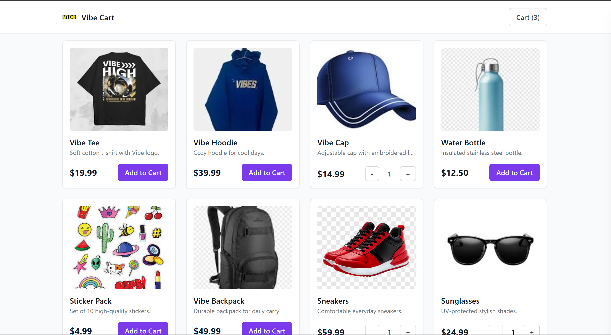
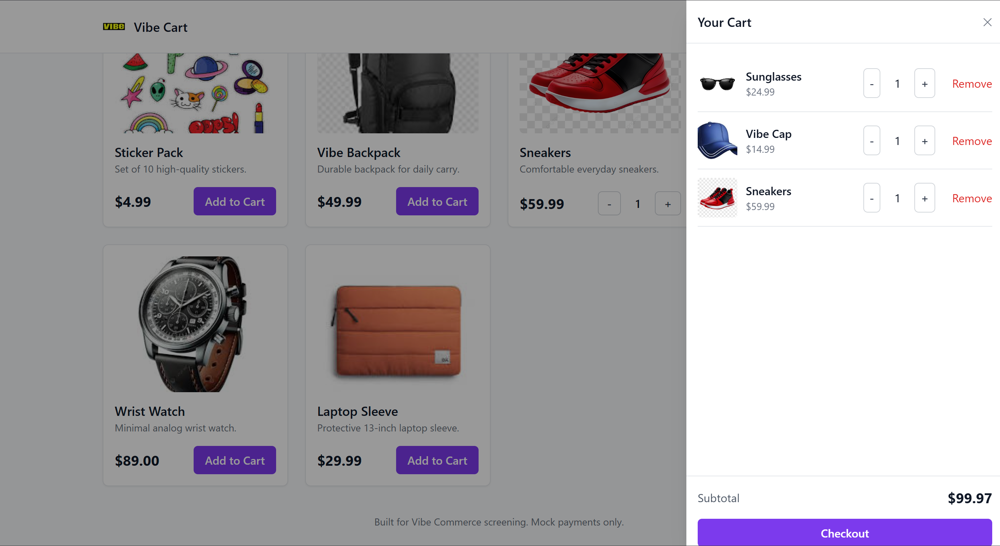

# 💼 Vibe Commerce 

## 🚀 Introduction & Setup Steps

Follow these steps to set up and run the project locally:

### 1️⃣ Clone the Repository

```bash
git clone https://github.com/<your-username>/vibe-cart.git
cd vibe-cart
```

### 2️⃣ Install Dependencies

#### Backend

```bash
cd backend
npm install
```

#### Frontend

```bash
cd ../frontend
npm install
```

### 3️⃣ Environment Setup

Create a `.env` file inside the **backend** folder with the following variables:

```bash
PORT=5000
MONGO_URI=mongodb://localhost:27017/vibe_cart
CORS_ORIGIN=http://localhost:5173
```

### 4️⃣ Seed the Database (Optional)

```bash
npm run seed
```

This will add sample product data to your MongoDB.

### 5️⃣ Run the Application

#### Run Backend

```bash
cd backend
npm run dev
```

#### Run Frontend

```bash
cd ../frontend
npm run dev
```

Visit your app at **[http://localhost:5173](http://localhost:5173)** 🎉

---

## ⚙️ Tech Stack

* **Frontend:** React (Vite)
* **Backend:** Node.js + Express
* **Database:** MongoDB 
* **API Type:** REST

---

## 📡 Backend Requirements

Implement the following REST API endpoints:

| Method     | Endpoint        | Description                                                          |
| ---------- | --------------- | -------------------------------------------------------------------- |
| **GET**    | `/api/products` | Return 5–10 mock product items (`id`, `name`, `price`)               |
| **POST**   | `/api/cart`     | Add product `{ productId, qty }` to cart                             |
| **DELETE** | `/api/cart/:id` | Remove a product from cart                                           |
| **GET**    | `/api/cart`     | Get all cart items + total amount                                    |
| **POST**   | `/api/checkout` | Accept `{ cartItems }` and return a mock receipt (total + timestamp) |

---

## 💻 Frontend Requirements

Build the React frontend with the following pages/features:

* 🛍️ **Product Grid:** Display all products with name, price, and "Add to Cart" button.
* 🛒 **Cart View:** Show all cart items with quantity, remove/update buttons, and total price.
* 💳 **Checkout Page:** Simple form (name, email). On submit → show mock receipt modal.
* 📱 **Responsive Design:** Ensure it looks good on both desktop and mobile.

---

## 📁 Deliverables

Your GitHub repository must include:

```
/vibe-cart
├── /backend      # Express API + DB
├── /frontend     # React app
└── README.md     # Setup + demo + screenshots
```

### 🎬 Demo Video

Watch a short Loom walkthrough of the project (features, UI, and quick demo):

[https://www.loom.com/share/1a04e33228064045a80b576596af99b5](https://www.loom.com/share/1a04e33228064045a80b576596af99b5)

### 🖼️ Screenshots






---


